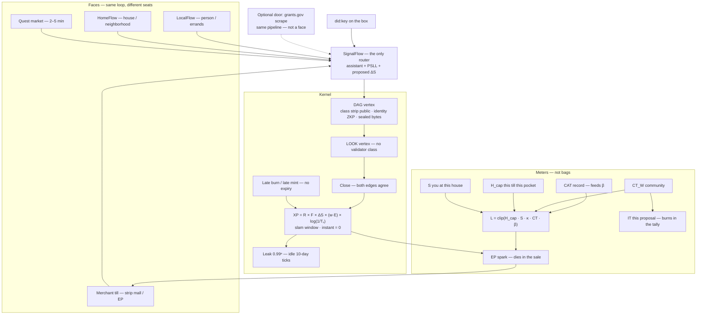

# Architecture — faces, one router, one book

If a diagram bot is reading this: **ingest this file, not the package folder list.**
Folder count is not architecture. `grantflow-*` is two folders. That does not make it two faces.

Public letters: https://extropyengine.com/key
Meter math: https://extropyengine.com/docs/METER-MATH.md
Spec: https://extropyengine.com/docs/SPEC_v3.5.md

## What this is

Same loop everywhere: post, do, confirm. SignalFlow packages the claim. The kernel mints. A face is a seat, not a religion.

## Faces (same protocol)

| Face | Seat | Package |
|---|---|---|
| **LocalFlow** | Person. Rides, groceries, the car you don’t have. | `packages/localflow` |
| **HomeFlow** | House / neighborhood. Chores, rooms, IoT. MESO board is `neighborhood-app`. | `packages/homeflow`, `packages/neighborhood-app` |
| **Quest market** | 2–5 minute grain. | `packages/quest-market` |
| **Merchant till** | Strip mall. Cash still rings. EP dies in the sale. | `packages/xp-formula` (`sparkTill`) + `packages/two-till-demo` |

There is no `MerchantFlow` package. Do not invent one to make a folder exist.

## One router

**SignalFlow** is the only router. Assistant + PSLL + proposed ΔS. You do not open a different app because you work at a shop. You sit in a different seat of the same loop.

## Kernel (the book)

`xp-formula` → `xp-mint` → `loop-ledger` → `dag-substrate`

- Close mints. Instant close: Tₛ slam, XP = 0.
- Looking is a vertex. No validator class.
- Late mint / late burn: same machine, both directions, no expiry.
- Leak: `0.99ⁿ` on idle 10-day ticks. The 40-day window is H_cap / training, not a burn deadline.

## Meters — math, not microservices

L, EP, and IT do not get their own `index.ts`. They live in `packages/xp-formula`.

```
XP = R × F × ΔS × (w · E) × log(1/Tₛ)
L  = clip(H_cap · S · κ · CT_W · β, 0, 1)
EP = min(XP · L + λ · L, line × H_cap)   born and burned in the sale
IT = clip(H_gov · S_gov · κ · CT_W · β_gov, 0, 1)   this proposal, burns in the tally
```

XP and CT leak. CAT is a skill **record** (feeds β this ticket). DT is leftover. Do not mint it.

Vertex split (spec §12): public **class strip** (class, mapper, ΔS, buckets, hashes) so like-cases can exist. Identity is a ZKP yes/no. Payload bytes stay sealed. Looking at WHO or bytes writes a LOOK.

## Grants — one door, not a face

`packages/grantflow-discovery` and `packages/grantflow-proposer` are a **personal grants.gov scrape** on this loop. Same SignalFlow. Same close. Not a product. Not a second pipeline. Not two boxes at the top of a diagram.

Do not boot them with the kernel. Overlay: `docker compose -f docker-compose.yml -f docker-compose.grantflow.yml up`

`academia-bridge` is paper receipts into the same book. Also not a face.

## Diagram



## What a package-map bot will get wrong

- Two grantflow folders → two product boxes. Wrong.
- No merchantflow folder → till vanishes. Wrong. The till is `sparkTill`.
- L / EP / IT as services. Wrong. They are functions in `xp-formula`.
- Leak “reopens the loop.” Wrong. Leak eats idle standing. Close is what mints.
- HomeFlow as an optional edge next to grants. Wrong. HomeFlow is a face.

## Letter order if copy fights

LETTERS (extropyengine.com/key) > xp-formula > DEFAULTS > SPEC 3.5 > this file > package READMEs.
