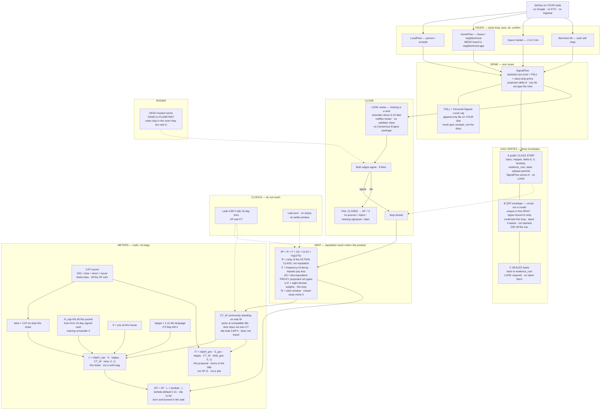

# Extropy Engine — Codex 3.0 map

**This file is the architecture.** Notebook LM, getdiagram, and humans: ingest **this file and `diagram.mmd`**. Do not inventory `packages/`. A folder is not a face.

Locked picture: [`docs/architecture/engine.svg`](docs/architecture/engine.svg)

Codex v2.1 stays signed. This map is what 3.0 must teach. Letters: https://extropyengine.com/key · meters: https://extropyengine.com/docs/METER-MATH.md · spec: [`docs/SPEC_v3.5.md`](docs/SPEC_v3.5.md) · capture: [`docs/CODEX_3_NOTES.md`](docs/CODEX_3_NOTES.md)

Same product everywhere: **post → do → confirm**. Confirmation is the receipt.

---

## Mermaid (copy this — also `diagram.mmd` at repo root)



---

## Reverse-engineer from this file

### Faces (four, equal, not protocols)

| Face | Seat |
|---|---|
| **LocalFlow** | Person. Rides, groceries, the car you don’t have. |
| **HomeFlow** | House / neighborhood. Chores, rooms, IoT. Neighborhood-app is the MESO board of HomeFlow, not a civic sidecar. |
| **Quest market** | 2–5 minute grain. Escalation if it sits. |
| **Merchant till** | Strip mall. Cash still rings. EP dies in the sale. `EP = XP · L + λ · L`, clip to list. |

Same loop on every face. There is no MerchantFlow app. There is no GrantFlow face.

### Spine

**SignalFlow** is the only router. You talk. It talks to (1) the assistant you trust, (2) your **PSLL**, (3) public class-strip priors on like-cases. It **proposes** ΔS. Humans do not type the mint. You do not score yourself.

**PSLL** = Personal Signed Local Log. Append-only, hash-chained, **file on your disk**. Merkle-anchored. Mesh gets receipts, not the diary. **Digital Autarky:** intelligence, identity, and local context stay at the edge.

**ZKP is a circuit, not a model.** Prover on YOUR box. Verifier gets yes/no. SignalFlow may help write a claim. It does not evaluate the proof.

### Vertex anatomy (spec §12)

A vertex is three parts:

1. **A — public class strip.** class, mapper, ΔS, U, buckets, evidence hashes, state, opaque parent ids. SignalFlow scours A. No LOOK. DID / GPS / exact clock / photo bytes in A is a **lose-condition**.
2. **B — ZKP envelope.** unique in this DFAO, signer bound to this strip, confirmed this loop, band if asked, not slashed. DID off the row.
3. **C — sealed bytes.** Hash to `evidence_root`. Reading C requires a **LOOK** vertex as parent. No silent fetch.

Like-cases live on A. That is how lawns calibrate lawns and coffee does not leak into lawns. Identity stays a yes/no.

### LOOK and close

**LOOK** is a vertex type. Looking is a verb. Volunteer slices, 3–10, later. Nullifier looker until a room votes unmask. Curator LOOKs can mint. Stalking-shaped bursts slash. Review LOOK (asterisk): graph-fact trigger, sealed bytes matching committed hashes only, not the rest of either PSLL.

**There is no validator class.** There is no Consensus Engine package. `epistemology-engine` witnesses. A neighbor is evidence, not a gavel.

Both edges agree (if-then). **Fail closed** → XP = 0.

### Canonical mint

```
XP = R × F × ΔS × (w · E) × log(1/Tₛ)
```

| Letter | Job | Not |
|---|---|---|
| **R** | Rarity of the **action class** ∈ [0.1, 10] | Reputation. Actor history. CT. |
| **F** | Frequency-of-decay. Repeats pay less. | Falsifiability. |
| **ΔS** | Bits-equivalent **proxy**. SignalFlow proposes from class-strip priors + evidence. Unknown leakage stays unknown. | XP itself. SI social heat. A number the human typed. |
| **w · E** | Eight-domain weights · this loop. Domain = instrument enum, not a bag. Lane = skill (CAT lives here). | Domain Token. |
| **Tₛ** | Slam window `exp(-λ min(Δt, Δt_cap))`. Instant close → log = 0 → XP = 0. | The 0.99ⁿ leak. Recency bonus. |

Reputation never enters this product. Floor analogy `XP ≥ ΔS / cₗ²` is structural, not a new physics law. Code: `packages/xp-formula`.

### Meter coupling (the till)

```
L  = clip(H_cap · S · κ · CT_W · β, 0, 1)
EP = XP · L + λ · L     (λ default 0.15, web publishes, 10-day notice)
IT = clip(H_gov · S_gov · κ · CT_W · β_gov, 0, 1)
```

| Letter | Job |
|---|---|
| **CT_W** | Community standing on web W. Same number at compatible tills. Door does **not** own CT. Idle leak 0.99ⁿ. Activity on that web resets n. Does not travel. Never enters the XP product. Feeds L and IT. |
| **H_cap** | This till this pocket. Auto from 10-day signed cash (two 5-day weeks). Training remainder 0 until that window fills. No slider. Unplug is Off. |
| **S** | This person at this house. |
| **κ** | 1 if they still speak the language. 0 if they left it (cash-wrap of CT). |
| **β** | CAT / on-duty this ticket. Not a CT wrap. |
| **λ** | Small floor so thin XP cannot erase a real L. |
| **L** | This ticket. Not a sixth bag. H_cap is already inside L — do not wrap another `min(..., line × H_cap)`. |
| **EP** | Till spark. Born and burned in the sale. Clip to list. Not a wallet. |
| **CAT** | Record `(DID, lane, level, issuer)`. Feeds β. Off the mint. |
| **IT** | This proposal. Burns in the tally. Not a pile. Not XP · G. Not 5%/month. |
| **XP** | Global standing. Non-transferable. No cash-out. Leak 0.99ⁿ. |

Official skins show cash + remainder. No raw XP on a forehead.

### Clocks — do not mash

| Clock | What |
|---|---|
| **Tₛ slam** | Instant close mints 0. On the mint. |
| **Leak 0.99ⁿ** | Idle 10-day ticks on remaining XP and CT. ~1%/tick. Access economy: you do not spend XP; it gets eaten. |
| **H window** | 10 days of **this till’s** signed cash. Training remainder 0. Not the leak tick. |
| **Late burn** | No expiry. No settle window. Five days or a decade. Marks the vertex and children. |

### Rooms

**DFAO** = Decentralized Fractal Autonomous Organization. Labels NANO → MICRO → MESO → MACRO → PLANETARY are suggested rule-sets, not headcount fences. A vote rewrites the room it is cast in. Only PLANETARY hits the mesh.

### Record / meter / spark

Stop saying token in public.

- **Record** — unique signed vertex (closed loop, CAT, complaint, EP written then burned).
- **Meter** — a number over records (XP remaining, CT, L, IT).
- **Spark** — EP at the till; IT in the tally. Dies in the act.

**DT is not a bag.** Expertise is CAT-per-lane. Leak is XP’s 0.99ⁿ.

### Calibration (why class strip exists)

Subjectivity is the opening condition. Like-cases on envelope A make the proxy less stupid. Lawn priors are lawns. Coffee is not a lawn. SignalFlow scours public strips, not diaries. Convergence is the bet, not day-one physics.

### What a generated diagram must never invent

- GrantFlow / grants.gov / academia as faces or a pipeline
- Consensus Engine as a package
- Token Economy as a wallet that returns EP
- Validator class / priesthood / first-validator
- Google Auth / OAuth / KYC as protocol identity
- Civic Integrations sidecar (neighborhood board is HomeFlow)
- Operations Dashboard as a face
- EP or IT as piles
- Leak reopening the loop
- Contributor as a hub that bypasses SignalFlow
- `[index.ts]` on boxes — a folder is not a face
- R as reputation
- CT inside the XP product

Authority if copy fights: LETTERS (extropyengine.com/key) > `xp-formula` > DEFAULTS > SPEC 3.5 > this file > package READMEs.
